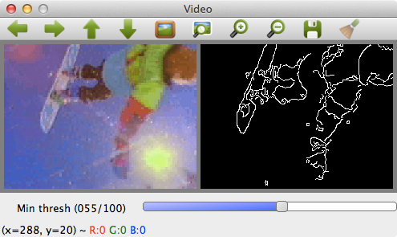
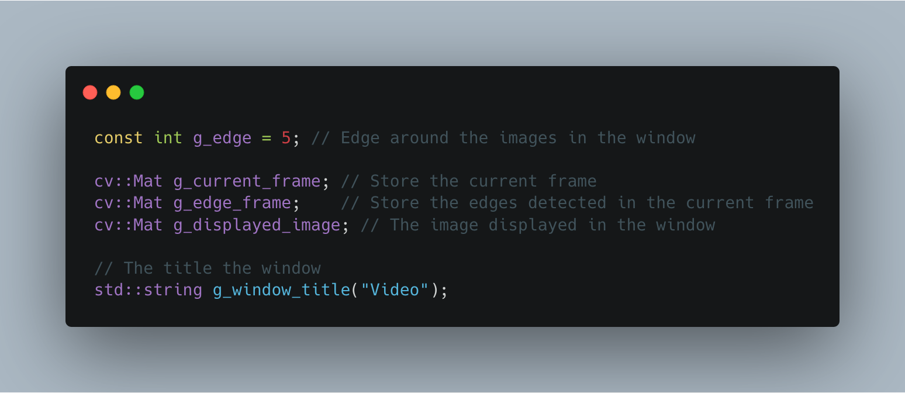

# ICP3038 - Computer Vision (CV)
## Lab 9: Playing a video from a file or the webcam
### Tutor: Franck Vidal

## Objectives

The aims of today's lab are:

- Playing a video from a file;
- Playing a video from a webcam;
- Processing the input frames to cartoonise them;
- Displaying two images side by side in the same window;
- Saving a video stream in a file (CAREFUL, they can become big).

The point is to use a video stream (from a file or a camera) and do some image processing on the incoming frames (and cartoonising images is fun). You will then adapt this lab to create your own motion detection algorithm.

To achieve these goals, we will create several programs:

1. `videoFromFile.cxx`: A simple program using OpenCV to display a video and perform some image processing tasks (this file is provided);
2. `videoFromWebCam.cxx`: A similar program where the video stream comes from a webcam (there is webcam on most laptops and on the PCs in the lab) (this file is not provided).

You are provided with the skeleton of `videoFromFile.cxx`.
% Add it to the `CMakeLists.txt` file from last week.

Everything we did last week is relevant for today's session.
You are also expected to have completed Lab~7 already as we need to convert an image from greyscale (binary in fact) to RGB.


**Note for Mac users:** I had problem OpenCV from Homebrew using my Macbook Pro. To enable the camera, I had to re-install it using the command line as follows:

- **OpenCV 3.x:** `brew install opencv3 --with-ffmpeg --with-libdc1394 --with-qt5`
- **OpenCV 4.x:** `brew install opencv4 --with-ffmpeg --with-libdc1394 --with-qt5`
It'll take a while as OpenCV needs to be re-compiled.


## Video from a file

We will write the code in `videoFromFile.cxx`.
The program takes three arguments from the command line:

- The input video file;
- A scaling factor to resize the input data (use `1` for no scaling);
- The output video file (optional).

Test videos can be found at:

- [http://www.mysticfractal.com/video/avi1.html](http://www.mysticfractal.com/video/avi1.html)
- [http://techslides.com/sample-files-for-development/](http://techslides.com/sample-files-for-development/)
- [http://www.technical-recipes.com/2011/displaying-avi-video-using-opencv/](http://www.technical-recipes.com/2011/displaying-avi-video-using-opencv/)
- [http://www.engr.colostate.edu/me/facil/dynamics/avis.htm](http://www.engr.colostate.edu/me/facil/dynamics/avis.htm)

We will display a window with two images, the input and the output, side by side (see Fig.~\ref{fig:screenshot}).



### Global Variables

First of all, we need some global variables:


<!--
```cpp
const int g_edge = 5; // Edge around the images in the window

cv::Mat g_current_frame; // Store the current frame
cv::Mat g_edge_frame;    // Store the edges detected in the current frame
cv::Mat g_displayed_image; // The image displayed in the window

// The title the window
string g_window_title("Video");
```-->

### Opening the video stream

The class corresponding to video streams, either from files or cameras, is `cv::VideoCapture`.
To opening a stream, use the constructor:

.png)
<!--
```cpp
// Open the video file
cv::VideoCapture video_capture(input_file_name);
```-->


Always check if an error occurred, and if it did, throw an error:

.png)

```cpp
// The image has not been loaded
if (!video_capture.isOpened())
{
    // Create an error message
    string error_message;
    error_message  = "Could not open or find the video \"";
    error_message += input_file_name;
    error_message += "\".";

    // Throw an error
    throw error_message;
}
```

Now we need to read the framerate and the image size:

.png)
<!--
```cpp
// Read the frame rate of the video (does not always work)
double fps = video_capture.get(CV_CAP_PROP_FPS);
cout << "Frame per seconds: " << fps << endl;

// Convert in seconds per frame
double seconds_per_frame(1.0 / fps);

// Convert in milliseconds
int milliseconds_per_frame(round(seconds_per_frame * 1000.0));

// Get the video size
cv::Size input_video_size(video_capture.get(CV_CAP_PROP_FRAME_WIDTH),
video_capture.get(CV_CAP_PROP_FRAME_HEIGHT));
```-->

For OpenCV 4, replace

- `CV_CAP_PROP_FPS` with `cv::CAP_PROP_FPS`
- `CV_CAP_PROP_FRAME_WIDTH` with `cv::CAP_PROP_FRAME_WIDTH`
- `CV_CAP_PROP_FRAME_HEIGHT` with `cv::CAP_PROP_FRAME_HEIGHT`

We can now compute the image size when the scaling factor is applied and the size of the image that will be displayed in the window:

.png)
<!--
```cpp
// Apply the scaling factor
cv::Size scaled_video_size(input_video_size.width * scaling_factor,
        input_video_size.height * scaling_factor);

// Set the size of the image displayed in the window
cv::Size target_video_size(g_edge * 3 + 2 * scaled_video_size.width,
        g_edge * 2 + scaled_video_size.height);
```-->

We are now ready to create our new RGB image with the default colour [128, 128, 128]:

.png)
<!--
```cpp
// Create the output image
g_displayed_image = cv::Mat(target_video_size.height,
        target_video_size.width,
        CV_8UC3,
        cv::Scalar(128, 128, 128));
```-->

### Setting the file writer

The class needed to write a file is `cv::VideoWriter`.
You will need to specify a file name and a codec when you open the file.
To get the codec of the input video stream, use:

.png)
<!--
```cpp
int input_codec = video_capture.get(CV_CAP_PROP_FOURCC);
```-->

To open the file, you need:

.png)
<!--
```cpp
video_writer.open(output_file_name, input_codec, fps, target_video_size, true);
```-->

You can notice the `fps` and `target_video_size` are used here to specify the properties of the video stream.

Below is the code you can use to open the output file:

.png)
<!--
```cpp
// Get the codec of the input video
int input_codec = video_capture.get(CV_CAP_PROP_FOURCC);

// Open the file writer with the same codec as the input
video_writer.open(output_file_name, input_codec, fps, target_video_size, true);

// The file is not open
if (!video_writer.isOpened())
{
    // Open the file writer with another codec
    video_writer.open(output_file_name, CV_FOURCC('M', 'J', 'P', 'G'), fps, target_video_size, true);

    // The file is not open
    if (!video_writer.isOpened())
    {
        // Display an error message
        cerr << "WARNING: Cannot create the output video." << endl;
    }
}
```-->

For OpenCV 4, replace

- `CV_CAP_PROP_FOURCC` with `cv::CAP_PROP_FOURCC`
- `CV_FOURCC` with `cv::VideoWriter::fourcc`

First we try to open the file with the same codec as the input file.
If it does not work, we try a codec that is provided by OpenCV directly.
Its drawback is that it produces large files as each frame is saved in JPEG.


### Reading a frame

We read frames in a loop of the form:

.png)
<!--
```cpp
// Last key pressed
int key;

// Input stream status
bool input_stream_status(true);

// Event loop
do
{
    // Grab the next frame if possible
    ...
    // The image was read from the video stream
    if (input_stream_status)
    {
        // Resize the input if needed
        if (input_video_size != scaled_video_size)
        {
            ...
        }

        // Process the image
        cartoonise(0, 0);

        // The file writer is working
        if (video_writer.isOpened())
        {
            // Add the current frame to the video output
            ...
        }

        // Wait for the key press event or for X ms
        // (with X equal to 'milliseconds_per_frame')
        key = cv::waitKey(milliseconds_per_frame);
    }
}
// Stop the loop if 'q' or 'Escape' have been pressed or
// there is no image left in the video stream
while (key != 'q' && key != 27 && input_stream_status);
```-->

We use a `do-while` loop to make sure that at least one image is processed.
We start by getting a new frame from the stream and check if an error occurred (e.g. no more frame to read).
If the input size has been changed, we rescale the frame.
Then the image processing step is performed in the `cartoonise` callback then the new image is added to the output stream if needed.
We now wait for the key press event or for $X$ milliseconds with $X=$`milliseconds_per_frame` (computed in Section \ref{sec:param}).


To get a frame, we use:

.png)
<!--
```cpp
input_stream_status = video_capture.read(g_current_frame);
```-->

It returns a boolean value, which is `true` if the function call was successful.
If it returned `false`, then there is no processing to do and the loop can end.

To resize the frame, use:

.png)
<!--
```cpp
if (input_video_size != scaled_video_size)
{
    cv::resize(g_current_frame, g_current_frame, scaled_video_size);
}
```-->

To add a frame to the output video stream,

.png)
<!--
use

```cpp
video_writer.write(g_displayed_image);
```

or

```cpp
video_writer << g_displayed_image;
```-->

### Image processing step

The code is written in the callback function.
This is why we needed global variables.

The data flow is as follows:

1. Copy the current frame (`g_current_frame`) into the large image (`g_displayed_image`). Add an edge of `g_edge` pixels around `g_current_frame`.
    We saw how to do it last week.
2. Convert the image (`g_current_frame`) to greyscale. Save the resulting image in (`greyscale_frame`).
3. Apply a median filter on `greyscale_frame` with a filter size of $7 \times 7$ pixels. Save the resulting image in `median_frame`.
4. Perform a Laplacian filter on `median_frame`.
You must use unsigned char for the output, i.e. the depth is `CV_8U`.
The kernel size is $5 \times 5$.
Save the resulting image in `edge_frame`.
5. Perform an edge detection using `edge_frame` and the threshold function. The threshold value is 100, the maximum value is 255, and the thresholding type is `THRES_BINARY_INV` (or 1).
   Save the resulting image in `mask_frame`.
6. Reduce the input image (`g_current_frame`) size by a factor 10 and resample using pixel area relation. Save the resulting image in `small_frame`. It is done using the code as follows:

```cpp
    float ds_factor = 4;
    cv::Mat small_frame;
#if CV_MAJOR_VERSION <= 3
    cv::resize(g_current_frame, small_frame, cv::Size(0, 0), 1.0 / ds_factor, 1.0 / ds_factor, CV_INTER_AREA);
#else
    cv::resize(g_current_frame, small_frame, cv::Size(0, 0), 1.0 / ds_factor, 1.0 / ds_factor, cv::INTER_AREA);
#endif
```

7. Apply a bilateral filter 10 times. \footnote{A bilateral filter is a non-linear, edge-preserving, and noise-reducing smoothing filter for images.}
    The kernel size is 5, sigma colour is 5, and sigma space is 7.
It is done using the code as follows:

```cpp
    // Save the resulting image in small_frame.
    for (int i = 0; i < 10; ++i)
    {
        cv::Mat temp;
        cv::bilateralFilter(small_frame, temp, 5, 5, 7);
        small_frame = temp;
    }
```

8. Restore the of the image (`small_frame`) so that it is the same as the input image (`g_current_frame`) and resample using bi-linear interpolation. Save the resulting image in `output_frame`.
It is done using the code as follows:

```cpp
    cv::Mat output_frame;
#if CV_MAJOR_VERSION <= 3
    cv::resize(small_frame, output_frame, cv::Size(0, 0), ds_factor, ds_factor, CV_INTER_LINEAR);
#else
    cv::resize(small_frame, output_frame, cv::Size(0, 0), ds_factor, ds_factor, cv::INTER_LINEAR);
#endif
```

9. Add a thick boundary using a boolean operator (AND).  Save the resulting image in `cartoon_frame`. It is done using the code as follows:

```cpp
    cv::Mat cartoon_frame;
    cv::bitwise_and(output_frame, output_frame, cartoon_frame, mask_frame);
```

10. Copy the result into the large image (`g_current_frame.cols`). It is done using the code as follows:

```cpp
    // Copy the result
    targetROI = g_displayed_image(cv::Rect(g_edge * 2 + g_current_frame.cols, g_edge, cartoon_frame.cols, cartoon_frame.rows));
    cartoon_frame.copyTo(targetROI);
```
11. Eventually display the result into the window.


## Video from a webcam

Copy `videoFromFile.cxx` into `videoFromCamera.cxx`.
Make sure you update `CMakeLists.txt` so that `videoFromCamera.cxx` is compile, and linked against OpenCV's libraries.

The program takes two arguments from the command line:

- A scaling factor to resize the input data (use 1 for no scaling);
- The output video file (optional).

Adapt the source code to take into account the changes in the command line arguments.
Also, set the number of frames per second to 15.

To use the camera instead of a file,

.png)

use
```cpp
    // Open the video stream from the camera
    cv::VideoCapture video_capture(0);
```
instead of
```cpp
    // Open the video stream from a file
    cv::VideoCapture video_capture(input_file_name);
```

Then you can create and process your own videos...
For example, Fig.~\ref{fig:screenshot2} shows my fish tank. You can also upload your video files on YouTube, see [https://www.youtube.com/watch?v=RbH2bdrNGbc](https://www.youtube.com/watch?v=RbH2bdrNGbc}.


